<a href="https://personal-portfolio-professional-gamma.vercel.app">
  <picture>
    <source media="(prefers-color-scheme: dark)" srcset="assets/card-dark.svg" />
    <source media="(prefers-color-scheme: light)" srcset="assets/card-light.svg" />
    
  </picture>
</a>

### I build AI systems that are honest about what they don't know, and ship them behind real backends.

## Featured

### [ReconAgent](https://github.com/BaconKage/ReconAgent) &nbsp;·&nbsp; payment reconciliation that refuses to guess

*Razorpay AI Buildathon, Track 04.* Reconciles settlement reports, bank statements and merchant ledgers. A deterministic engine over integer paise decides every match; the LLM only explains the exceptions and can never move one. When the data can't settle a payment, it says so instead of picking the closer amount.

<table>
<tr>
<td align="center" width="25%"><h3>100%</h3>precision on the held-out set</td>
<td align="center" width="25%"><h3>0</h3>unsafe auto-resolves</td>
<td align="center" width="25%"><h3>0 / 644</h3>grounding violations</td>
<td align="center" width="25%"><h3>245</h3>tests, CI on Python 3.10 & 3.13</td>
</tr>
</table>

### Shipped & live

<table>
<tr>
<td width="50%" valign="top">

**[MyGym](https://mygym.co.in)** 
Gym management platform for owners, trainers and coaches: members, sessions, scheduling and an admin dashboard. 
Node · Express · MongoDB · React &nbsp;|&nbsp; [backend](https://github.com/BaconKage/My_Gym_Admin_Backend) · [admin](https://github.com/BaconKage/My_Gym_Admin_Page)

</td>
<td width="50%" valign="top">

**[BhashaBuddy](https://parampara-one.vercel.app)** 
Offline AI writing tutor for NRI children. Compares Tesseract, EasyOCR and Google Vision, then gives feedback through a local LLM. No paid APIs. 
FastAPI · Next.js · Ollama &nbsp;|&nbsp; [repo](https://github.com/BaconKage/BhashaBuddy)

</td>
</tr>
<tr>
<td width="50%" valign="top">

**[TransLat AI](https://github.com/BaconKage/TransLat)** 
Document translation for legal, medical and technical files. OCR fallback for scans, offline NLLB-200 translation, SHA-256 integrity receipts. 
TypeScript · Python · NLLB · OCR

</td>
<td width="50%" valign="top">

**[RVU Placements Revamp](https://rvu-placements-revamp.vercel.app)** 
Competition redesign of RV University's placement site: a draggable recruiter wall, student and recruiter paths, and a registration form. 
React · Vite &nbsp;|&nbsp; [repo](https://github.com/BaconKage/rvu-placements-revamp)

</td>
</tr>
</table>

## Live

<!-- live:start -->
**[Content Death Clock](https://github.com/BaconKage/content-death-clock) collector** &nbsp;·&nbsp; running unattended on GitHub Actions since 30 Aug: **14,556** engagement snapshots of **1,301** YouTube videos across 606 collection cycles, 665 still being tracked. Last cycle 48 min ago when this was built.

**Latest commits**

- [`rvu-preprints`](https://github.com/BaconKage/rvu-preprints) &nbsp;Stop tracking the backend virtualenv [24 Sep](https://github.com/BaconKage/rvu-preprints/commit/251f8e2d95ffee9896cdcd74522369e86e06c933)
- [`Personal_Portfolio_Professional`](https://github.com/BaconKage/Personal_Portfolio_Professional) &nbsp;Performance pass and buttermax-style mouse effects [24 Sep](https://github.com/BaconKage/Personal_Portfolio_Professional/commit/5740eedf2e679b1a6f043da8ba0d12d87ed75399)
- [`WhiteCloudRealty`](https://github.com/BaconKage/WhiteCloudRealty) &nbsp;Fix double page load on navigation and full-height hero [23 Sep](https://github.com/BaconKage/WhiteCloudRealty/commit/e2c87d65f518f3870cbf8d7675d5fa23e110c598)
- [`firstdropai0-code/HealthCareSim`](https://github.com/firstdropai0-code/HealthCareSim) &nbsp;Offer the whole app in Hindi, not just the run flow [23 Sep](https://github.com/firstdropai0-code/HealthCareSim/commit/86ac82881b35183d967f5c60cd591fc43e2cb462)
- [`content-death-clock`](https://github.com/BaconKage/content-death-clock) &nbsp;Guard against analysing a cohort before it has matured; refresh status text [20 Sep](https://github.com/BaconKage/content-death-clock/commit/1ae4022c95bcab07e2045ef4ca8fe4657ebb0f8f)

Rebuilt daily by [a GitHub Action](.github/workflows/profile.yml) · last run 25 Sep 2026, 08:48 UTC
<!-- live:end -->

## Research

- **Imperfection as a constitutive property of artificial intelligence.** *AI & Society*, Springer, 2025. Argues that AI's flaws should be treated as a design principle rather than a defect. [Read the paper](https://link.springer.com/article/10.1007/s00146-025-02837-2)
- **[Content Death Clock](https://github.com/BaconKage/content-death-clock)** *(in progress).* Predicts *when* a YouTube video stops getting attention, not whether it goes viral. A live collector builds repeated observations of real uploads for a survival model.

<b>More projects</b>

 

- **[Flucture AI](https://github.com/BaconKage/flutcture-final)** - real-time posture tracking with OpenCV and MediaPipe, with AI-written correction reports
- **[Food Vision Backend](https://github.com/BaconKage/Food_Vision_Backend)** - FastAPI service that reads foods and macros from a photo with OpenAI vision and syncs them into MongoDB meal plans
- **[Ena](https://github.com/BaconKage/ena-flask-server)** - emotionally aware chatbot on Flask and Groq's LLaMA 3, steered by sentiment and entropy analysis ([demo](https://tinyurl.com/Ena-emotion))
- **[Body Transformation Preview](https://github.com/BaconKage/Transformation)** - previews a 6-month and 1-year result for a chosen workout and diet plan ([live](https://transformation-chi.vercel.app))
- **[UniERP](https://github.com/BaconKage/UniERP)** - university ERP in React, TypeScript and Firebase
- **[Portfolio](https://github.com/BaconKage/Personal_Portfolio_Professional)** - immersive portfolio in Next.js, Three.js and GSAP

## Stack

 

## Now

Final year of my Data Science degree, collecting data for Content Death Clock, and open to interesting problems. Reach me by [email](mailto:vardashubhang@gmail.com) or on [LinkedIn](https://linkedin.com/in/shubhang-srinivas-varda-322ba4297/).
